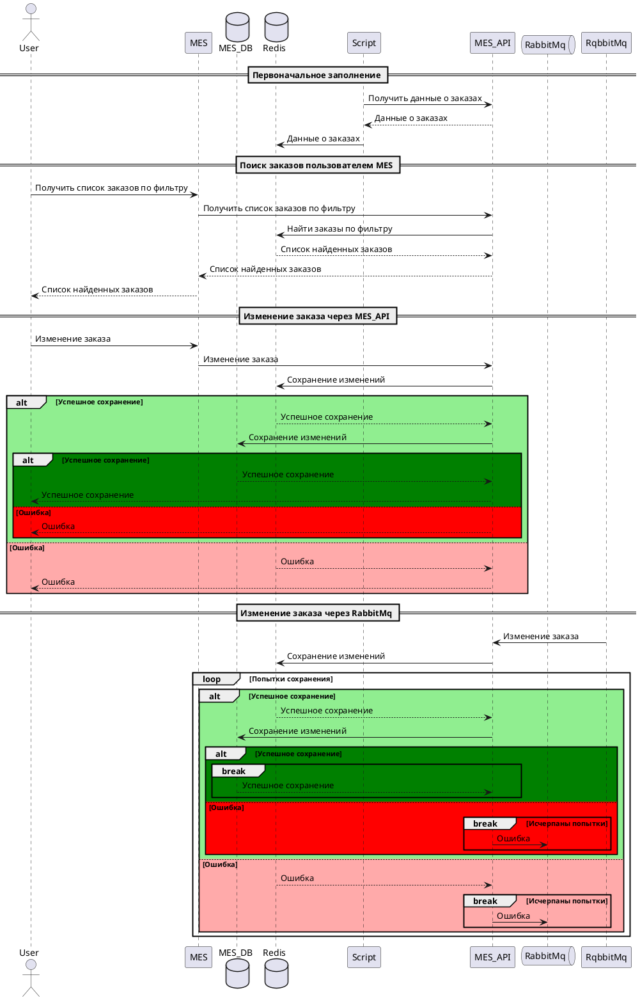

# Анализ диаграммы

Закешировать следует:
- все статические файлы всех фронтендов: js, css, различные изображения и шрифты
- данные наиболее проблемных участков - заказы в MES

# Мотивация

Кеширование статический файлов на стороне клиента позволит уменьшить количество передаваемых данных по сети, что увеличит скорость ответа сервера - он будет меньше передавать данных - и увеличит скорость работы фронтенда - он будет выбирать уже готовые данные из своего кеша, а не формировать их заново.

Кеширование на бекенде снизит нагрузку на MES API и на БД, с которой он взаимодействует по заказам, а также увеличит скорость ответа бекенда на запросы.

# Предлагаемое решение

При запросах от фронтенда сервер может сравнивать даты последних изменений этих файлов со значением в заголовке If-Modified-Since. Если файлы не изменились, то сервер вернет код 304

Пример
Cache-Control: no-cache 
If-Modified-Since Wed, 1 Jan 2024 11:11:11 GMT

Заказы на MES необходимо кешировать методом Write-Through на сервере.
Т.к. все пользователи будут делать запрос к кешу, то он должен обновляться вместе с БД синхронно. Это позволит всем операторам сразу видеть актуальные данные. С учетом медленного обновления статусов заказов - пересчёт длится минуты, а остальные действия выполняются людьми - нагрузка на БД должна существенно снизиться.

При использовании Refresh-ahead пользователи будут видеть старые данные и брать в работу уже взятые кем-то другим заказы. Этот метод не подходит

При Write-Behind и возникновении ошибки изменения данных в БД пользователь об этом никогда не узнает или узнает слишком поздно, что приведет к недовольству клиентов и исполнителей заказов. Первые не получат заказ, а вторые потеряют потенциальный доход. Этот метод тоже не подходит. 

Кеширование на стороне клиента не подходит, т.к. данные по заказам формируются в списки по фильтрам и страницам. Количество комбинаций этих параметров может быть большим. Кеш может просто переполнится. В добавок к этому при достаточном количестве заказов изменения их статусов будет приводить к частому обновлению кеша, что сведет его полезность на "нет". Даже если удастся каким-то образом определить дату завершения валидности кеша.

# Диаграмма последовательности 

